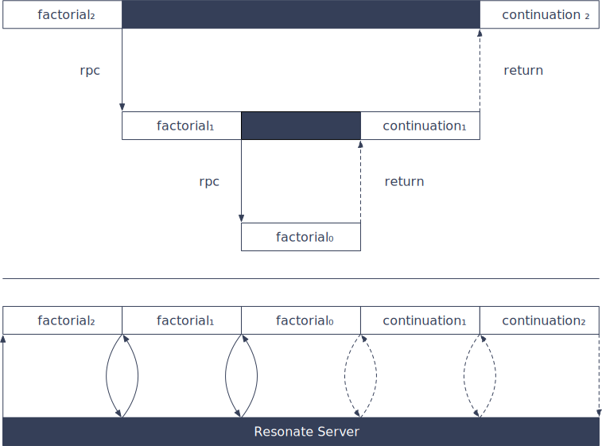

# @resonatehq/gcp

`@resonatehq/gcp` is the official binding to run [Resonate](https://github.com/resonatehq/resonate) durable execution workers on [Google Cloud Functions](https://cloud.google.com/functions). Write long-running, stateful applications on short-lived, stateless serverless infrastructure.

## Installation

```bash
npm install @resonatehq/gcp
```

## How it works

When a Durable Function suspends (e.g. on `yield* context.rpc()` or `context.sleep()`), the Cloud Function **terminates**. When the Durable Promise completes, the Resonate Server resumes the function by invoking it again — no long-running process required.



## Usage

Register your functions and export the HTTP handler from your Cloud Function entry point:

```ts
import { Resonate } from "@resonatehq/gcp";
import type { Context } from "@resonatehq/gcp";

const resonate = new Resonate();

resonate.register("countdown", function* countdown(ctx: Context, n: number): Generator {
  if (n <= 0) {
    console.log("done");
    return;
  }
  console.log(n);
  yield* ctx.sleep(1000);
  yield* ctx.rpc(countdown, n - 1);
});

// Export as a Google Cloud Functions HTTP handler
export const handler = resonate.httpHandler();
```

Deploy this as a Google Cloud Function with an HTTP trigger. The Resonate Server will call your handler to invoke and resume durable functions.

See the [Google Cloud Functions documentation](https://cloud.google.com/functions/docs) to learn how to develop and deploy Cloud Functions.

## Authentication

When your Cloud Function calls back to the Resonate Server, `@resonatehq/gcp` attaches an OIDC ID token automatically. This lets you protect the Resonate Server with IAM without any additional configuration.

### Default: `auto`

`new Resonate()` defaults to `auth: { mode: "auto" }`:

- If the server URL starts with `https://`, an OIDC ID token is minted via [Application Default Credentials](https://cloud.google.com/docs/authentication/application-default-credentials) and attached as `Authorization: Bearer <token>`.
- If the server URL starts with `http://` (local development), no token is attached.

Tokens are cached per audience and refreshed automatically before they expire.

### Explicit modes

```ts
// Auto (default) — HTTPS targets get OIDC token, HTTP targets get nothing
const resonate = new Resonate();

// Explicit OIDC ID token
const resonate = new Resonate({ auth: { mode: "oidcIdToken" } });

// OIDC with custom audience
const resonate = new Resonate({
  auth: { mode: "oidcIdToken", audience: "https://my-server.example.com" },
});

// Static bearer token
const resonate = new Resonate({ auth: { mode: "bearer", token: "my-token" } });

// No auth
const resonate = new Resonate({ auth: { mode: "none" } });
```

On Cloud Run / GCE, ADC resolves automatically to the service account identity. For local development with a service account key, set `GOOGLE_APPLICATION_CREDENTIALS` to the key file path.

## Examples

- [Durable Countdown on Google Cloud Functions](https://github.com/resonatehq-examples/example-countdown-gcp-ts)
- [Durable Research Agent on Google Cloud Functions](https://github.com/resonatehq-examples/example-openai-deep-research-agent-gcp-ts)

## Documentation

Full documentation: [docs.resonatehq.io](https://docs.resonatehq.io)
